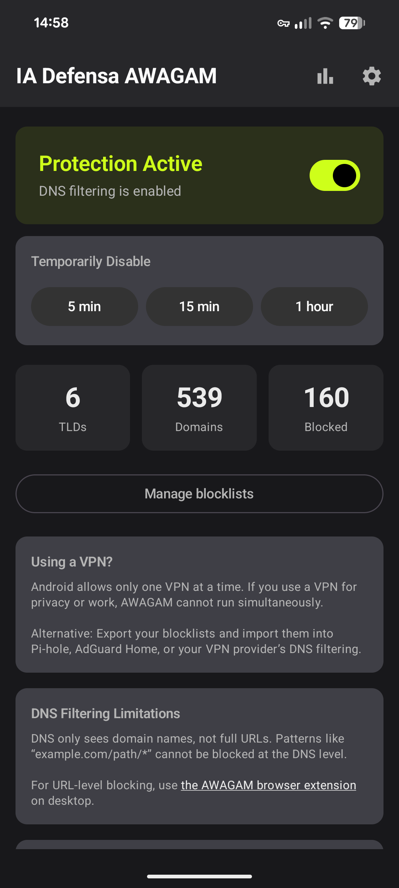

# IA Defensa AWAGAM TLD and Domain Blocker

<!-- @@ Uncommen/link once app is available on at least one store -->

<!-- Visit IA Defensa for [general information about this app](https://iadefensa.com/solutions/awagam-android/). -->

<!-- Really, GitHub? -->
<div align="center">
	</a>
</div>

## Development

### Requirements

* Android Studio Otter 3 Feature Drop (2025.2.3) or newer
* JDK 21
* Android SDK 37

### Debug Build

```shell
./gradlew assembleDebug
```

Output: `app/build/outputs/apk/debug/awagam-*.apk`

Debug builds are not minified and keep debug logging, so they don’t reflect what ships. Verify behavior against a release build before distributing.

### Tests

```shell
./gradlew testDebugUnitTest
```

Unit tests also run automatically before `assembleDebug` and `assembleRelease`.

### Release Build

Without a signing key the release build still succeeds, but the APK is unsigned and cannot be installed on a device. To produce an installable build, first create a keystore:

```shell
keytool -genkey -v -keystore awagam-release.jks -keyalg RSA -keysize 2048 -validity 10000 -alias awagam
```

Then create `keystore.properties` in the project root (this file is gitignored):

```properties
storeFile=awagam-release.jks
storePassword=your_store_password
keyAlias=awagam
keyPassword=your_key_password
```

Build the release:

```shell
# Signed APK (for direct distribution)
./gradlew assembleRelease

# Android App Bundle (required for Play Store)
./gradlew bundleRelease
```

Output:
* APK: `app/build/outputs/apk/release/awagam-*.apk`
* AAB: `app/build/outputs/bundle/release/awagam-release.aab`

Each release after the first needs `versionCode` incremented in `app/build.gradle.kts`; Android refuses to install a build whose `versionCode` is not higher than the installed one.

### Running on a Device

```shell
./gradlew assembleRelease && adb install -r app/build/outputs/apk/release/awagam-*.apk
```

`-r` replaces the installed app while preserving its configuration. Switching signing keys requires `adb uninstall com.awagam.android` first, as Android rejects an update signed with a different key. Expect to grant VPN consent again after reinstalling.

The app ships with no blocking rules, so a fresh install blocks nothing until a blocklist is added under Settings. [The AWAGAM blocklists repository](https://github.com/j9t/awagam-blocklists) has ready-made lists for testing.

### Distribution

| Platform | Format | Notes |
| --- | --- | --- |
| **Play Store** | AAB | Upload the `.aab` file |
| **Direct** | APK | Distribute the signed `.apk` file |
| **F-Droid** | APK | Built from source by F-Droid; listing metadata in `fastlane/` |

(Play Store builds are signed by Google under Play App Signing, so their signature differs from that of a locally built APK. The two are not update-compatible: switching between direct and Play installs requires uninstalling first, which clears the app’s configuration.)

The build is configured for reproducibility (`org.gradle.reproducibleFileOrder`, `org.gradle.reproducibleArchiveContents`, and `dependenciesInfo` omitted from APK and bundle). Release builds also strip debug logging via ProGuard, so no DNS query data reaches logcat—see [the privacy policy](PRIVACY.md).

Store listing text and images live in `fastlane/metadata/android/en-US/`: `title.txt`, `short_description.txt`, `full_description.txt`, per-`versionCode` notes under `changelogs/`, and `images/` (`icon.png` 512×512, `featureGraphic.png` 1024×500, `phoneScreenshots/`). F-Droid reads these directly; for the Play Store they are the source to copy from.

#### Play Console Declarations

These answers describe the app, not a particular release, so they hold until the app’s behavior changes. Restate them verbatim whenever the console asks again.

**VPN (App content → VPN).** The app uses `VpnService`, and this is its core functionality. It establishes a local, on-device VPN interface for the sole purpose of intercepting DNS queries and comparing them against user-configured blocklists. Blocked lookups are answered locally with `0.0.0.0`; all others are forwarded to the user-selected DNS-over-HTTPS resolver. No other traffic is routed, inspected, proxied, or sent to any server operated by the developer.

**`specialUse` foreground service justification.** DNS filtering must keep running while the user is in other apps, so the `VpnService` runs in the foreground. Android defines no foreground service type for VPN or DNS filtering, which leaves `specialUse` as the only applicable type; the declared subtype is `DNS filtering for content blocking` (see `PROPERTY_SPECIAL_USE_FGS_SUBTYPE` in `app/src/main/AndroidManifest.xml`). The service runs only while the user has protection enabled, and stops when they disable it.

**Data safety.** The app collects and shares no user data, so the form reduces to “No” on data collection and data sharing; the encryption-in-transit and data-deletion questions do not apply. Preferences, cached blocklists, and query counts stay on the device, are never transmitted, and are removed on uninstall. `android:allowBackup="false"` plus the backup and data extraction rules keep them out of Android backup and device-to-device transfer as well. There is no analytics, telemetry, crash reporting, advertising, or DNS query logging. The two outbound connection types—DNS queries to the user’s chosen resolver and blocklist fetches from URLs the user adds—are user-initiated app functionality, not collection by the developer.

**Privacy policy URL.** `https://github.com/iadefensa/awagam-android/blob/main/PRIVACY.md`

**Content rating.** Category: utility or productivity. Every content question (violence, sexuality, profanity, controlled substances, gambling, horror) is “No.” The app has no user-generated content, no user-to-user communication, no ads, and no digital purchases, and it neither collects nor shares location or personal information.

### Project Structure

```
com.awagam.android/
├── AWAGAMApplication.kt     # Init, DI, notifications, WorkManager
├── MainActivity.kt          # Entry, VPN permission, navigation
├── data/blocklist/          # BlocklistRepository, DomainMatcher, Exporter, Models, Validator, ExternalBlocklistManager
├── data/preferences/        # UserPreferences (DataStore), DnsProviders (upstream catalog)
├── di/                      # DependencyContainer
├── dns/                     # DnsCache (LRU+TTL), DnsResolver (DoH)
├── receiver/                # BootReceiver
├── statistics/              # StatisticsManager
├── ui/screens/              # Home, Settings, Statistics
├── ui/viewmodel/            # Home, Settings, Statistics ViewModels
├── ui/theme/                # Material 3 theme
├── util/                    # NumberFormatting
├── vpn/                     # AWAGAMVpnService
└── worker/                  # BlocklistUpdateWorker (6h check, 24h per list), VpnWatchdogWorker (15min)
```

Tests: `BlocklistDeletionTest`, `BlocklistParserTest`, `BlocklistRefreshIntervalTest`, `BlocklistValidatorTest`, `DnsCacheTest`, `DnsPacketTest`, `DnsProvidersTest`, `DnsResolverTest`, `DomainMatcherTest`, `ExternalBlocklistManagerTest`, `HomeViewModelTest`, `NumberFormattingTest`, `SettingsViewModelTest`, `StatisticsManagerTest`

## Contributing

[Contributions are welcome.](CONTRIBUTING.md) They are subject to the [Contributor License Agreement](CLA.md).

## License

AWAGAM Android is free software, licensed under [the GNU General Public License, version 3 or later](LICENSE.txt). It comes with no warranty.

Commercial terms are available on request for use that the GPL does not accommodate.